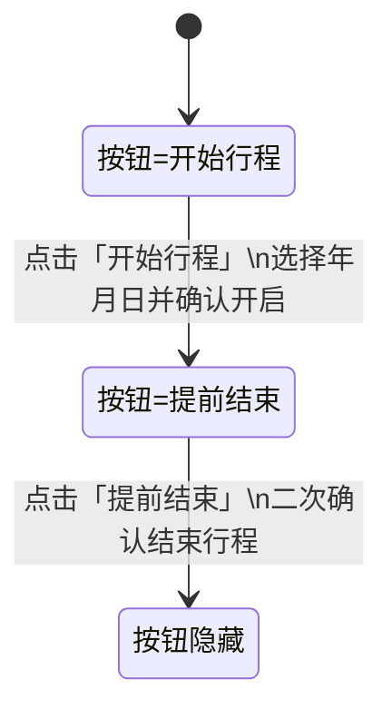

# 开始行程按钮 - 三种设计方案

**当前已采用方案三**（右下角胶囊）。

---

## 方案一：信息栏内嵌（默认）

**设计思路**：将「开始行程」作为信息栏中的一项，与「3天」标签并列，使用相同的毛玻璃胶囊风格。

**特点**：
- 与「3天」等标签视觉统一，同为 `bg-white/10` 毛玻璃圆角
- 作为卡片底部信息组的一部分，不抢眼
- 轻量、自然融入

**适用**：希望操作低调、与信息平级的场景。

---

## 方案二：底部条带式

**设计思路**：在标题、日期、标签下方增加一条独立操作条，用细分割线与上方内容区分，按钮占满整行。

**特点**：
- 操作区域明确，有独立存在感
- 半透明条带与底部渐变融为一体
- 全宽按钮，点击区域大

**适用**：希望突出「开始行程」为主要操作、引导性更强的场景。

---

## 方案三：右下角胶囊

**设计思路**：将按钮放在卡片右下角，与底部信息区对齐，采用轻量胶囊样式。

**特点**：
- 不占用信息栏空间，布局更紧凑
- 右下角符合常见操作按钮位置
- 小尺寸胶囊，不干扰主内容

**适用**：希望保持信息区简洁、操作入口不占主视觉的场景。

### 交互图（状态切换）

### 交互说明

- 默认状态显示右下角胶囊按钮：`开始行程`
- 用户点击并确认开启后，按钮即时切换为：`提前结束`
- 用户点击 `提前结束` 并确认后，行程结束，按钮隐藏
