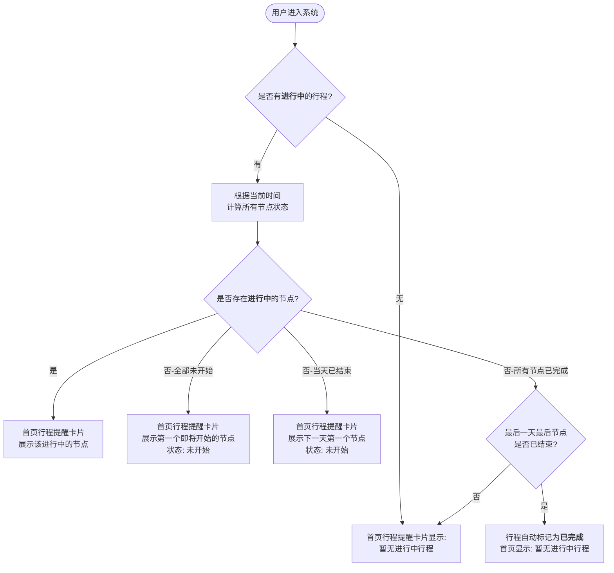
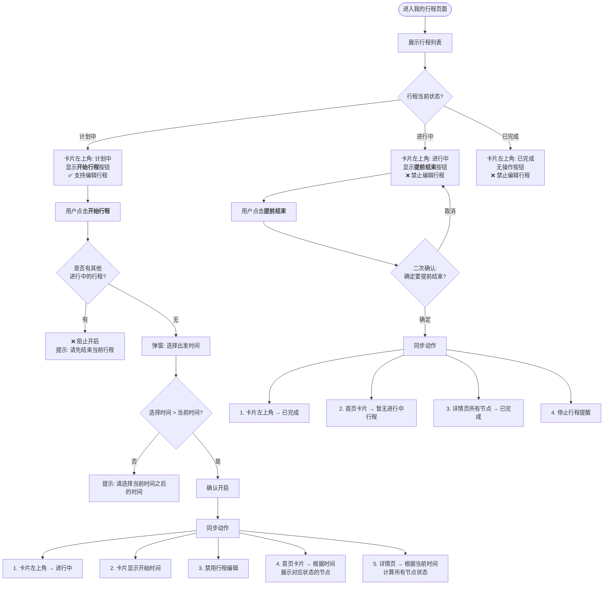
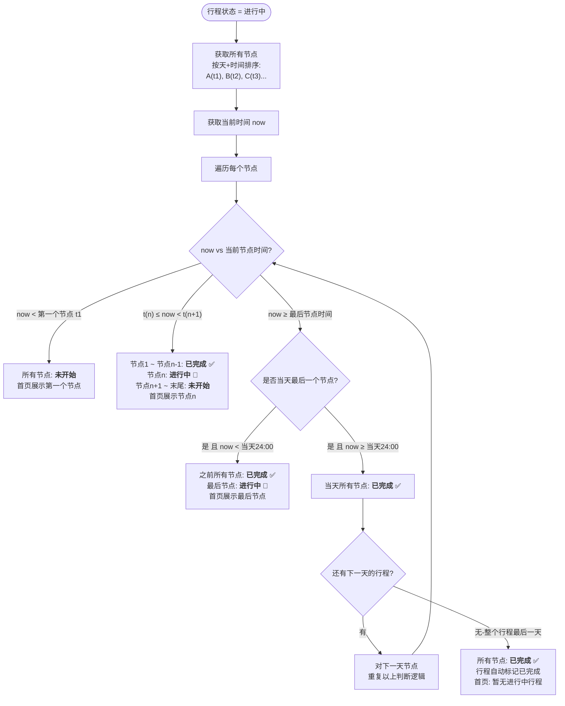
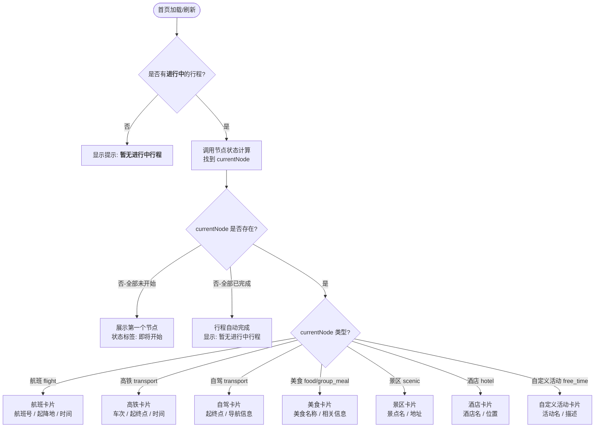
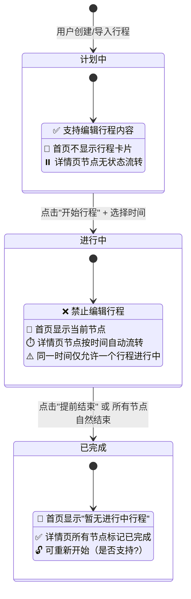

# 行程状态流程图

## 一、整体状态流转（我的行程 → 首页卡片 → 详情页节点）



## 二、我的行程 — 开始/结束行程操作流



## 三、详情页节点状态计算规则（核心算法）



### 节点状态计算伪代码

```
function calcNodeStatuses(allNodes, now):
    currentNode = null
    
    for i = 0 to allNodes.length - 1:
        node = allNodes[i]
        nextNode = allNodes[i + 1]  // 可能为 null
        
        if now < node.startTime:
            // 当前时间早于该节点 → 该节点及之后全部"未开始"
            node.status = "未开始"
            // 后续节点也全部"未开始"（可 break）
            
        else if nextNode == null || now < nextNode.startTime:
            // 当前时间 ≥ 该节点时间，且 < 下一个节点时间
            // → 该节点"进行中"
            node.status = "进行中"
            currentNode = node
            
            // 检查跨天: 如果该节点是当天最后一个，且 now ≥ 24:00
            if isDayLastNode(node) && now >= endOfDay(node.date):
                node.status = "已完成"
                currentNode = null
            
        else:
            // 当前时间 ≥ 该节点时间，且 ≥ 下一个节点时间
            // → 该节点"已完成"
            node.status = "已完成"
    
    return currentNode  // 首页展示该节点
```

## 四、首页行程提醒卡片逻辑



## 五、状态对照表



## 六、节点状态时间线示例

```
假设行程已开始，节点按时间排列:

Day 1: A(08:00) → B(10:00) → C(12:30) → D(14:00)
Day 2: E(08:30) → F(12:30) → G(18:00)
Day 3: H(10:00) → I(16:00)

━━━ Day 1 ━━━━━━━━━━━━━━━━━━━━━━━━━━━━━━━━━━━━━━
now = 07:00  │ A未开始  B未开始  C未开始  D未开始  │ 首页→A(即将开始)
now = 08:00  │ A进行中🔵 B未开始  C未开始  D未开始  │ 首页→A
now = 09:30  │ A进行中🔵 B未开始  C未开始  D未开始  │ 首页→A
now = 10:00  │ A已完成✅ B进行中🔵 C未开始  D未开始  │ 首页→B
now = 12:30  │ A已完成✅ B已完成✅ C进行中🔵 D未开始  │ 首页→C
now = 14:00  │ A已完成✅ B已完成✅ C已完成✅ D进行中🔵 │ 首页→D
now = 24:00  │ A已完成✅ B已完成✅ C已完成✅ D已完成✅ │ 当天结束

━━━ Day 2 ━━━━━━━━━━━━━━━━━━━━━━━━━━━━━━━━━━━━━━
now = 07:00  │ E未开始  F未开始  G未开始            │ 首页→E(即将开始)
now = 08:30  │ E进行中🔵 F未开始  G未开始            │ 首页→E
now = 12:30  │ E已完成✅ F进行中🔵 G未开始            │ 首页→F
now = 18:00  │ E已完成✅ F已完成✅ G进行中🔵           │ 首页→G
now = 24:00  │ E已完成✅ F已完成✅ G已完成✅            │ 当天结束

━━━ Day 3 ━━━━━━━━━━━━━━━━━━━━━━━━━━━━━━━━━━━━━━
now = 10:00  │ H进行中🔵 I未开始                     │ 首页→H
now = 16:00  │ H已完成✅ I进行中🔵                    │ 首页→I
now = 24:00  │ H已完成✅ I已完成✅                     │ 行程自动完成
                                                     │ 首页→暂无进行中行程
```

## 七、关键联动关系

```
┌──────────────────┐      ┌──────────────────┐      ┌──────────────────┐
│    我的行程       │      │    首页卡片       │      │    详情页         │
│   (Trip页面)      │      │   (Home页面)      │      │  (TripDetail)    │
├──────────────────┤      ├──────────────────┤      ├──────────────────┤
│                  │      │                  │      │                  │
│ 计划中           │──▶   │ 暂无进行中行程    │      │ 节点无状态流转    │
│                  │      │                  │      │                  │
│ 开始行程         │──▶   │ 展示当前进行中/   │──▶   │ 节点按时间        │
│ (进行中)         │      │ 即将开始的节点    │      │ 自动流转状态      │
│                  │      │                  │      │                  │
│ 提前结束         │──▶   │ 暂无进行中行程    │──▶   │ 所有节点          │
│ (已完成)         │      │                  │      │ 标记已完成        │
│                  │      │                  │      │                  │
│ 自然结束         │──▶   │ 暂无进行中行程    │──▶   │ 所有节点          │
│ (最后节点完成)    │      │                  │      │ 标记已完成        │
└──────────────────┘      └──────────────────┘      └──────────────────┘
```

## 八、已识别的逻辑漏洞及补充

| # | 漏洞描述 | 补充方案 |
|---|---------|---------|
| 1 | 原流程仅判断"是否有行程"，未区分行程状态 | 改为判断"是否有**进行中**的行程" |
| 2 | 节点状态仅对比"="（精确相等），忽略了时间区间 | 改为区间判断：t(n) ≤ now < t(n+1) 时，节点n为进行中 |
| 3 | 结束行程后首页未明确显示内容 | 结束后首页显示"暂无进行中行程" |
| 4 | 未处理"行程自然结束"场景 | 最后一天最后节点完成后，行程自动标记已完成 |
| 5 | 未限制同时只能有一个进行中行程 | 开始新行程前检查是否有其他进行中行程，有则阻止 |
| 6 | 首页未处理"全部未开始"的情况 | 当所有节点未开始时，展示第一个节点并标注"即将开始" |
| 7 | 未考虑跨天间隙（当天结束到次日第一个节点之间） | 当天24:00后当天节点全部完成，次日节点根据时间判断 |
| 8 | 首页卡片类型遗漏了自定义活动和团餐 | 补充 free_time 和 group_meal 类型的卡片展示 |
| 9 | 未说明"已完成"行程是否可重新开始 | 需产品确认：已完成行程是否支持重新开启 |
